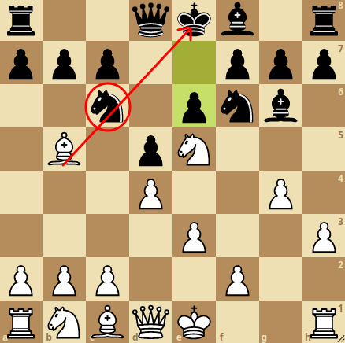
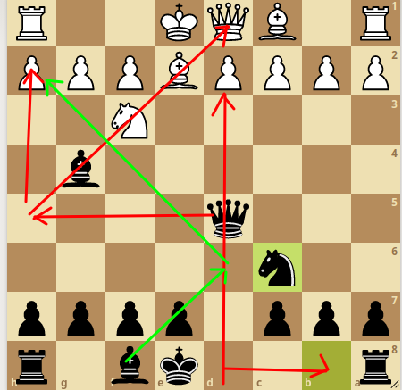

# My Chess Openings - Miguel Angelo do Amaral Junior

> Neste página, quero documentar um pouco sobre minha visão do Xadrez e também mostrar a forma simples que desenvolvi de jogar e que alcancei bons resultados contra bons players experientes.

## Introdução
> Primeiramente para mim o Xadrez é basicamente um jogo de estudo de **aberturas** com **conceitos básicos** somado a **criatividade** e **racioncínio rápido**. Para que você consiga bons resultados no Xadrez você deve enteder as aberturas do jogo, depois os conceitos básicos, tais como:

- Evoluir suas peças.
- Não cravar suas peças e sim dos seus adversários.
- Não trocar peças importantes por um simples peão.
- Controlar o centro (nem sempre te garantirá vitória).
- Não sair com a rainha em início de jogo.
- Saber abrir as laterais do jogo para sua torre passar.
- Sempre desconfiar de um cavalo encoberto por um bispo ou dama (isso realmente é muito perigoso), pois somente o cavalo defende atacando e ataca defendendo!
- Entender que sempre uma troca de cavalo ou bispo por torre é algo perigoso, mas nem sempre irá ter duas torres irá te garantir a vitória.
- Jogos entre 1 a 2 minutos de tempo total pra cada jogador, podem levar a grandes viradas, portanto não desista, mesmo que tenha perdido sua dama.
- E por fim e não menos importante, sabe jogar um final de partida (ganhar o centro, não deixar o rei adversário transpor-se a frente dos peões etc)

##### Obs: Para jogar Xadrez utilizo o aplicativo [Lichess](https://lichess.org/), meu email para contato é <miguel.junior.mat@hotmail.com>.

## Meu Início de Jogo.

 Antes de começar, precisamos saber se iremos jogar de **Brancas** ou **Negras**.

- Se você iniciar de **Brancas**, você deve buscar o desenvolvimento e pressionar seu adversário, pois você sempre estará uma jogada á frente dele.
- Caso jogue de **Negras**, você deve ter uma postura mais cautelosa, mais defensiva e buscar sempre o contra-ataque, pois se eles tem uma jogada a frente sua, quer dizer quer eles também correm o risco de cometer um erro a sua frente, assim, você poder decidir a partida. Contudo, de **negras**, você também pode buscar o desenvolvimento precoce, no entanto, terá de abrir mão de uma peça, que provavelmente se tudo ocorrer direito, você irá recuperar no final da partida.

 Vamos lá, iremos iniciar meu tutorial pelas brancas.
 
 ## Brancas
 
 1. Gosto de desenvolver o cavalo da rainha primeiramente, pois penso que a primeira jogada não é tão determinante pro jogo, pois sempre que você evolui cavalo ou bispo é uma boa jogada... Sem contar que isso confunde seu adversário, que na grande maioria das vezes espera um peão em e4 ou d4.
 
 2. Caso seu adversário jogue um peão em e5 ou d5, você repetirá a mesma jogada que ele, feito isso você trava o jogo central e evita ele avançar pra cima de você, caso ele queira ainda fazer isso, ele terá de se expor mais.... vejamos como pode ter ficado nosso tabuleiro.
 

3. Contudo, caso seu adversário opte por desenvolver cavalo também, você desenvolve o outro.

4. Daqui em diante provavelmente ele irá abrir um d5... lembre-se da nossa regra inicial, de brancas, espelhe o centro com seu adversário que você sairá na vantagem.
 

5. Caso ele abra um outro cavalo, então você sem pensar pode jogar um peão d4 e daqui em diante é com você, na minha visão você estará na vantagem no futuro, pois terá muitos pontos de como pressionar ele.

6. tente forçar sempre a peça em c6 com bispo branco e cavalo... bons jogadores cometem erros quando o tempo é curto, geralmente você sairá na vantage, veja a imagem abaixo.

7. O bom mesmo é quando as brancas tiram o peão branco delas e travam o centro com o peão e6.... isso geralmente coloca as brancas em total vantagem, pois terá de usar a rainha negra para se defender!

O que pode resultar em um ataque perigoso, como abaixo.

8. Outra tática excelente de brancas, é quando seu oponente decide fazer a defesa indiana do rei... você terá muitas vantagens em fazer o roque maior! ( LEMBRE-SE DE SEMPRE COLOCAR O SEU BISPO PRETO ALINHADO COM A SUA RAINHA PRETA, POIS QUANDO SEU OPONENTE USA A DEFESA INDIANA DE PRETRA, SEU FOCO É DESTRUIR AQUELE BISPO PRETO!)

Veja uma situação pós Ataque, perceba como é vantajoso para as brancas, se adiantar o peão em h5 ou h6 irá dar muito trabalho para as pretas defender, sem contar que qualquer peça que apareça perto de d4, a dama branca poderá dar um check e pegar um cavalo no futuro ou algo do tipo.

## Negras

De negras eu gosto de jogar ou na defensiva tentando algum contra ataque, ou na ofensiva sacrificando um peão para ganhar desenvolvimento no lugar... lembre-se, existem ótimos jogadores que tem dificuldades quando encontram uma defesa sólida bem compactada.

1. Basicamente, tudo depende do que o seu oponente irá fazer... se ele avança o peão em d5, ele te dá oportunidade de aplicar a opção do sacrifício... onde basicamente você responde com e4.

Desta posição podem surgir muitas variações, mas o normal mesmo é que as brancas capturem o peão preto, então poderão sofrer nas mãos das pretas.

Uma possível situação é essa acima, onde a dama branca está no centro do tabuleiro. Daqui podemos chegar até uma outra posição de muito risco para as brancas. Dependendo do que as branca jogarem, as negras poderão conquista um mate muito rápido com a remoção do cavalo em f3.

2. Geralmente a **Defesa Índia do Rei** é muito útil de negras. Perceba que caso o peão branco de e5 force um ataque, provavelmente as brancas sairão perdendo, podendo perder até mesmo o roque com a troca de dama por dama.

Apesar de ser uma boa alternativa, deve-se ter sempre atenção com as brancas quando tentarem a troca de bispo preto por preto, pois ele é o segredor por manter a defesa das negras bem compactada. Veja uma situação chata para as negras, se a negra fizer o roque, provavelmente as brancas vão jogar bispo em h6 e forçar uma troca. Vale lembrar que mesmo que esse bispo em h6 venha aparecer, nunca capture ele com o seu bispo, pois isso trará a dama muito próximo ao rei das negras... na pior das hipóteses, deixe as brancas atacarem o bispo negro das negras.

No entanto, uma alternativa a essa situação seria realizar o roque antes do alinhamento da Dama branca com o bispo negro, possibilitando as negras a tirar a torre da linha do bispo preto em h6 e caso o bispo negro das brancas forçassem a troca, basta as negras evitarem essa troca jogando o bispo em h8 (veja abaixo).

Apesar de ser muito defensiva, a Índia do Rei também tem um ataque força mais para o fim da partida, veja uma situação que mesmo torcando um bispo por 2 peões as negras começam a incomodar muito as brancas.

> LOADING ... >:D

